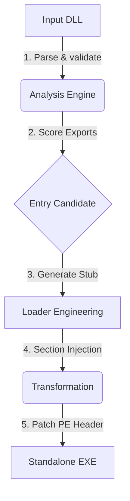

# 🚀 ExeMorph – Advanced PE Transformation & Execution Engine


**ExeMorph** is a next-generation security tool designed to transform **Windows DLLs** into fully functional, standalone **EXE binaries**. Unlike simple header patchers, ExeMorph employs deep PE analysis to intelligently select export candidates, generate custom bootstrap loaders, and seamlessly reconstruct the execution flow.

Built for **malware analysts**, **red teamers**, and **reverse engineers**, it turns static libraries into dynamic executables for easier debugging, behavioral analysis, and payload weaponization.

---

## ✨ Key Features

- **🔍 Intelligent Analysis**: Automatically parses PE headers and Export Tables to score and rank potential entry points (exports/DllMain).
- **🛠️ Seamless Conversion**: Transforms a DLL into a valid EXE with a single command, handling all PE characteristic updates.
- **💉 Custom Loader Engine**: Injects a robust, assembly-based bootstrap stub (x64) that initializes the CRT and resolves imports before execution.
- **🧩 Smart Header Manipulation**: Dynamically adds PE sections (`.morph`) and realigns virtual addresses to ensure stability.
- **🛡️ Stealth & Precision**: Operates with minimal artifacts, preserving the original specialized logic of the targeted DLL.

---

## 🏗️ Architecture

ExeMorph operates in a four-stage pipeline to ensure a stable transformation:



1. **Analysis**: The engine inspects the DLL, identifying the architecture (x64/x86) and enumerating exported functions.
2. **Selection**: Users (or the auto-scorer) select the best export to serve as the new main entry point.
3. **Loader Generation**: A position-independent shellcode stub is generated to set up the stack, align registers, and call the target function.
4. **Transformation**: The PE header is patched (stripping `IMAGE_FILE_DLL`), a new `.morph` section is injected with the loader, and the Entry Point (OEP) is redirected.

---

## 🚀 Getting Started

### Prerequisites

- **Go 1.22+** installed on your machine.
- **Mingw-w64** (optional, for compiling test DLLs locally).

### Installation

Install the latest version directly via `go install`:

```bash
go install github.com/ismailtsdln/ExeMorph/cmd/exemorph@latest
```

Or build from source:

```bash
git clone https://github.com/ismailtsdln/ExeMorph.git
cd ExeMorph
go build -o exemorph cmd/exemorph/main.go
```

---

## 📖 Usage Guide

ExeMorph features a modern, intuitive CLI.

### 1. Analyze a DLL

Before converting, inspect the DLL to find suitable export functions.

```bash
exemorph analyze payload.dll
```

**Output:**

```
Analyzing payload.dll...
Architecture: x64
Is DLL: true

Execution Candidates:
TYPE    NAME            ADDRESS     SCORE
Export  RunPayload      0x1020      1.00
Export  ReflectiveLdr   0x1540      0.85
Main    DllMain         0x1000      0.50
```

### 2. Build Standalone EXE

Convert the DLL into an EXE, specifying the desired entry point.

```bash
exemorph build payload.dll --entry RunPayload -o payload.exe
```

- `--entry`: The name of the exported function to execute (optional).
- `-o`: (Optional) Output filename. Defaults to `<input>.exe`.

### 3. Verification

Run the resulting executable on a Windows machine (or Wine):

```bash
./payload.exe
```

---

## ⚠️ Disclaimer

**ExeMorph is intended for educational purposes, security research, and authorized red teaming engagements only.**

Misuse of this software to violate the law is strictly prohibited. The authors are not responsible for any illegal use of this tool. Always obtain proper authorization before testing on external systems.

## 📄 License

Distributed under the **MIT License**. See `LICENSE` for more information.
